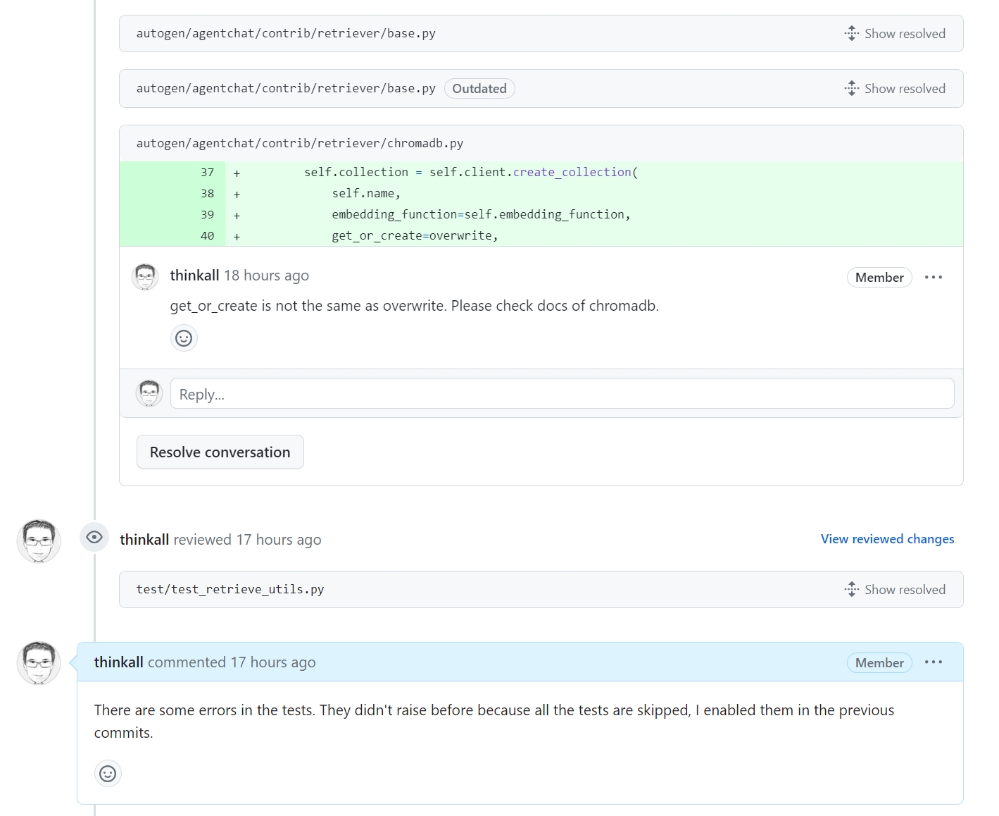
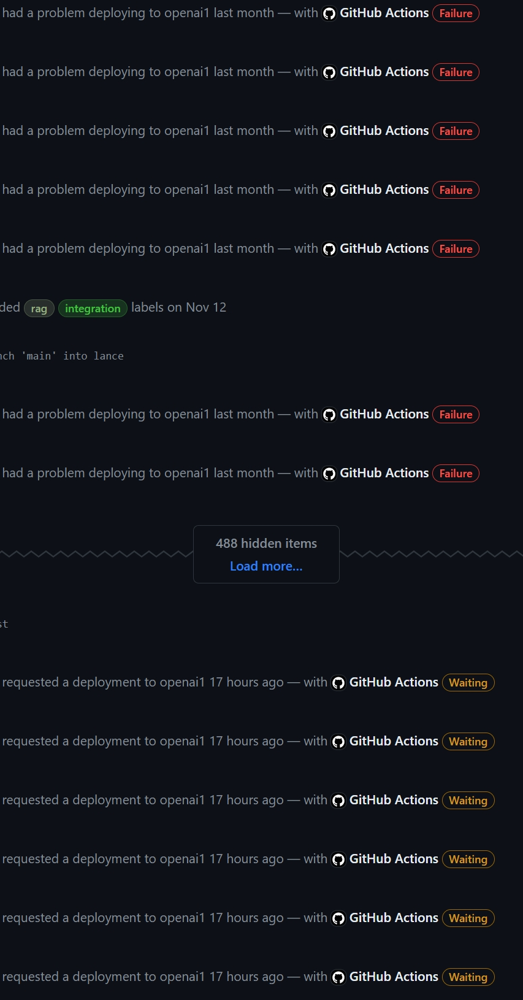

# tinytools
Tiny tools for easier life

## 1. [Hide "GitHub Actions"](<Tampermonkey-Scripts/Hide -GitHub Actions- Notifications in PR Conversations-0.1.user.js>)
Hide "GitHub Actions" div elements on GitHub pull request page so other comments will not be hidden.

Install it on [Greasy Fork](https://greasyfork.org/en/scripts/482085-hide-github-actions-notifications-in-pr-conversations).

### With script working, you can see reviewers' comments.

### With out the script, reviewers' comments could be hidden and you can only see Github Actions.

